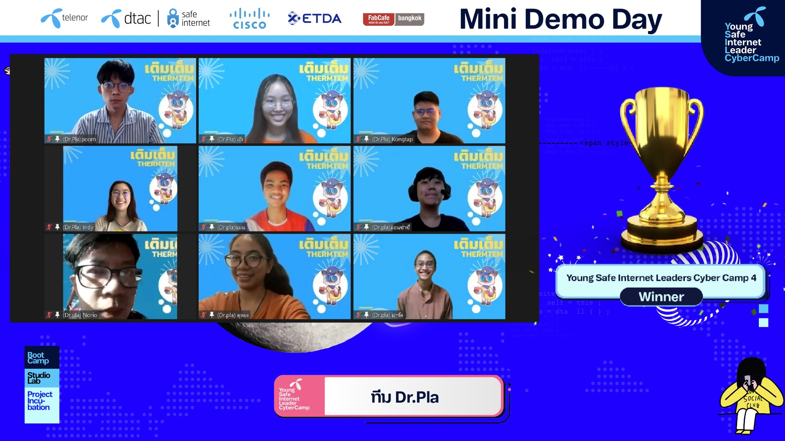

# Dr. Pla, We won 🎉🎊✨

<detail>

แหล่งข่าว

- [DTAC ประกาศผล 5 ทีมเยาวชนใช้เทคโนโลยีจัดการภัยคุกคามทาง Cyber เวที dtac Young Safe Internet Leaders’ Cyber Camp ปี 4 - telecomlover.com](https://www.telecomlover.com/2022/05/13/dtac-5-team/)
- [dtac ประกาศ 5 ทีมเยาวชนไอเดียดี จากงาน Young Safe Internet Leaders’ Cyber Camp ปี 4 - ผู้จัดการออนไลน์](https://mgronline.com/cyberbiz/detail/9650000045783)
- [dtac ประกาศผล 5 ทีมเยาวชน ประชันสุดยอดไอเดีย ใช้เทคโนโลยีจัดการกับภัยคุกคามทางไซเบอร์ - whatphone.net](https://www.whatphone.net/news/dtac-dtac-young-safe-internet-leaders/)
- [ดีแทคใช้ Metaverse ประกาศ 5 ทีมเยาวชนผู้ชนะที่ใช้เทคจัดการภัยไซเบอร์ - springnews.co.th](https://www.springnews.co.th/pr-news/news/824473)
- [5 ทีมเยาวชน ประชันสุดยอดไอเดีย ใช้เทคโนโลยีจัดกันกับภัยคุกคามทางไซเบอร์ จากเวทีงาน dtac Young Safe Internet Leaders’ Cyber Camp ปี 4 - การเงินธนาคาร](https://www.moneyandbanking.co.th/article/pr-news/dtac-young-idea-technology-140565)
</detail>

ขอขอบคุณทุก ๆ คนที่ร่วมทำงานมากันจนถึงตอนนี้ ไม่นึกเลยว่าจะมาไกลได้ถึงขนาดนี้ เปลี่ยนหัวข้อกันบ่อยมาก แก้กันหลายรอบ ปั่นกันสุด ๆ ช่วงวันสุดท้าย ทุกคนยอดมากเลย

## เติมเต็ม: ศูนย์กลางความช่วยเหลือที่ไม่มีที่ว่างให้มิจฉาชีพ

ปัญหาการแอบอ้างรับเงินบริจาค ส่วนใหญ่เป็นเงินจำนวนน้อย ผู้บริจาคจึงไม่คิดอะไร เว็บไซต์ช่วยเติมเต็มความช่วยเหลือ โดยการรวบรวมข้อมูลที่ถูกต้อง และช่วยตรวจสอบรวบรวมผู้รับบริจาค ตัดมิจฉาชีพออกจากวงจรการบริจาค เว็บไซต์ “เติมเต็ม” รวบรวมผู้ที่ต้องการความช่วยเหลือ เน้นเป็นที่รายบุคคล(ไม่ใช่องค์กร/กิจกรรม) โดยข้อมูลผู้ต้องการรับบริจาค จะมีการตรวจสอบจากตัวผู้ต้องการรับบริจาค ชุมชน หรือผู้ที่มีข้อมูล เพื่อรับรองว่าต้องการความช่วยเหลือจริงๆ โดยเมื่อผ่านจะมีการนำชื่อ/บัญชี/ยอด/รายละเอียด ลงในเว็ปไซต์ ป้องกันช่องโหว่สำหรับมิจฉาชีพ

### 3 บริการหลักของเติมเต็ม
1. ผู้ขอรับบริจาค - รวบรวมข้อมูลรายชื่อผู้ที่ต้องการความช่วยเหลือ โดยมีรายละเอียดลต่างๆ ซึ่งได้รับการตรวจสอบและยืนยันแล้วว่าเป็นความจริง สร้างความเชื่อมั่น ช่องทางและรายละเอียดยังช่วยสร้างโอกาสด้านอื่นๆให้กับผู้ที่อยากยื่นมือเข้ามาช่วยด้วย นอกจากนี้เมื่อยอดเงินถึงแล้ว ยังได้แบ่งปันโอกาสให้กับผู้ที่เดือดร้อนคนอื่นๆด้วย
2. ยื่นขอรับบริจาค - ผู้ที่ต้องการความช่วยเหลือกรอกประวัติต่างๆ และเมื่อได้รับการติดต่อ ตรวจสอบ และยืนยันแล้วว่าเป็นความจริง จะมีการนำขึ้นประชาสัมพันธ์บนเว็บไซต์ เพื่อเพิ่มโอกาสการมองเห็นและช่วยผู้ที่กำลังเดือดร้อน
3. แสกนรูปภาพ - ผู้ใช้งานสามารถเซฟรูปที่ได้จากมิขฉาชีพมาตรวจสอบ เปรียบเทียบกับรูปที่มีอยู่ในฐานข้อมูลเพื่อแสดงข้อมูลรายละเอียดที่ถูกต้องของผู้ประสบภัยตัวจริง

โครงการของเรายังไม่เสร็จสมบูรณ์ดี โดยคุณสามารถดูเว็บไซต์ตัวอย่างของเราได้ที่ [https://yslc4-team06.vercel.app]()

## สมาชิกในทีม
- `CEO` dt-043 มาร์ค
- `CMO` dt-184 ม่อน
- `CMO` dt-081 เอ๊ะ
- `CTO` dt-166 พัส
- `CTO` dt-168 กองทัพ
- `CCO` dt-191 ภูมิ
- `CCO` dt-073 อินดี้
- `CFO` dt-044 ดุหยง